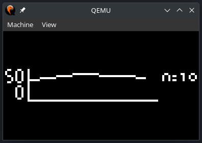
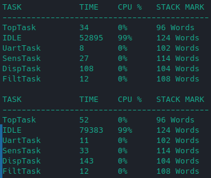

# Temperature Measurement System Implemented in Real-Time Operating System

## Date - 2023

Application of a real-time operating system in an embedded system. Simulation of a temperature control system with a low-pass filter. UART communication with a computer to display the system status and change the filtering coefficient.

### Authors:
- **Robledo, Valentín**

## Abstract
In this project, a temperature sensor is simulated. Then, we obtain the sensor data by applying a low-pass filter. The sensing is implemented using *RTOS* or *Real Time Operating System*. It is implemented on a *Stellaris LM3S811* microcontroller emulated using QEMU.

In addition, *UART* communication is added to be able to view system information and change the low-pass filter coefficient.

## How to clone this repository?
You can clone this repository to any directory you want using the following command:

```console
git clone https://github.com/valentinrb1/rtos-temperature-sensor.git
```

## How to use?
First, we move to the project folder.

```bash
cd rtos-temperature-sensor
```

Inside the project directory we run the *make* command.
```bash
make
```

To run the program we need the qemu emulator. We can start the program with a default coefficient or send it by *UART*.

By default:
```bash
qemu-system-arm -M lm3s811evb -serial stdio -kernel gcc/RTOSApp.axf
```

By *UART*:
```bash
echo -n " ​​12" | qemu-system-arm -M lm3s811evb -serial stdio -kernel gcc/RTOSApp.axf #Coefficient of 12.
```

---
## Operation

When you run the program, a window of the *QEMU* emulator will open, which allows you to see the temperature graph and the coefficient that is being used on the microcontroller display.

<p align="center">

</p>

In addition, you can view the system status on the console. You can see the name of the task, the time occupied, the percentage of CPU usage and the available stack.

<p align="center">

</p>
